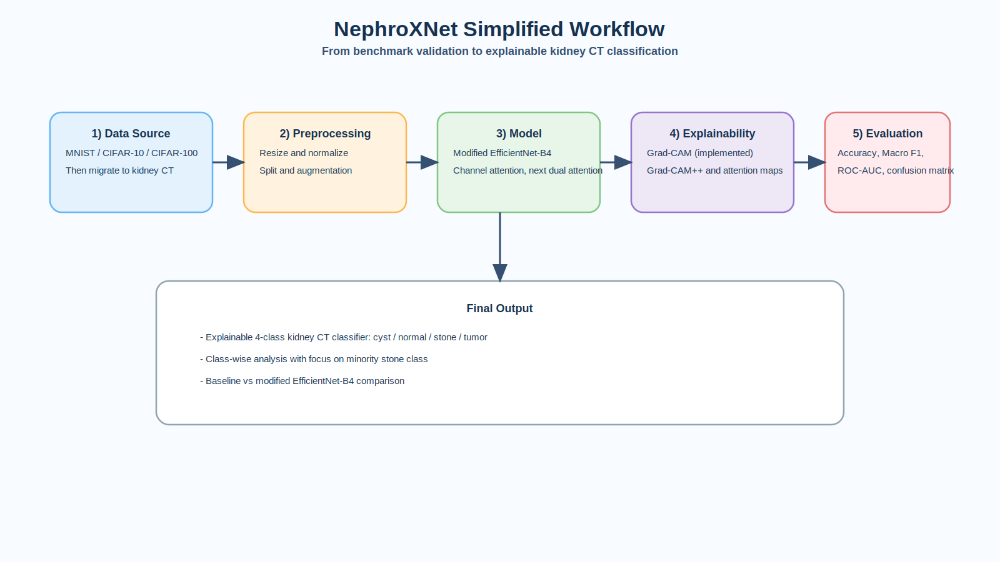

# NephroXNet Presentation (Short Version)

## Slide 1 - Project Overview
- Goal: Explainable 4-class kidney CT classification (`cyst`, `normal`, `stone`, `tumor`).
- Base direction: Modified EfficientNet-B4 + attention + explainability.
- Outcome target: clinically useful and interpretable kidney CT model.

---

## Slide 2 - Data
- Current development datasets: `MNIST`, `CIFAR-10`, `CIFAR-100`.
- Final target dataset: IEEE DataPort kidney CT (4 classes).
- Keep the same pipeline structure and replace dataset/preprocessing module for CT.
- Apply stratified split, augmentation, and imbalance-aware sampling/weighting.

---

## Slide 3 - Modified EfficientNet-B4 and Attention Mechanism
 Start from EfficientNetB4 backbone.
 Use channel attention baseline (`se` / `eca`) in current implementation.
 Add spatial attention and multiscale feature fusion in modified version.
 Distillation code is optional and not required for core experiments.

---

## Slide 4 - Model Evaluation and Explainability
- Metrics: Accuracy, Macro F1, ROC-AUC, confusion matrix, class-wise sensitivity.
- Priority analysis: minority `stone` class performance and error patterns.
- Explainability: Grad-CAM (implemented), Grad-CAM++ and attention maps (next).
- Goal: produce clinically interpretable prediction evidence.

---

## Slide 5 - Current Status
- EfficientNet-B4 prototype, training loop, and Grad-CAM are already implemented.
- Current attention modes in code: `se`, `eca`, `none` (channel-focused).
- Dual attention is the next model upgrade.
- Presentation figure: `nephroxnet_presentation_workflow.svg`.

---

## Slide 6 - Workflow Figure
- Insert full figure: `nephroxnet_presentation_workflow.svg`
- Use this as the visual summary of data, model, explainability, and evaluation flow.

---

