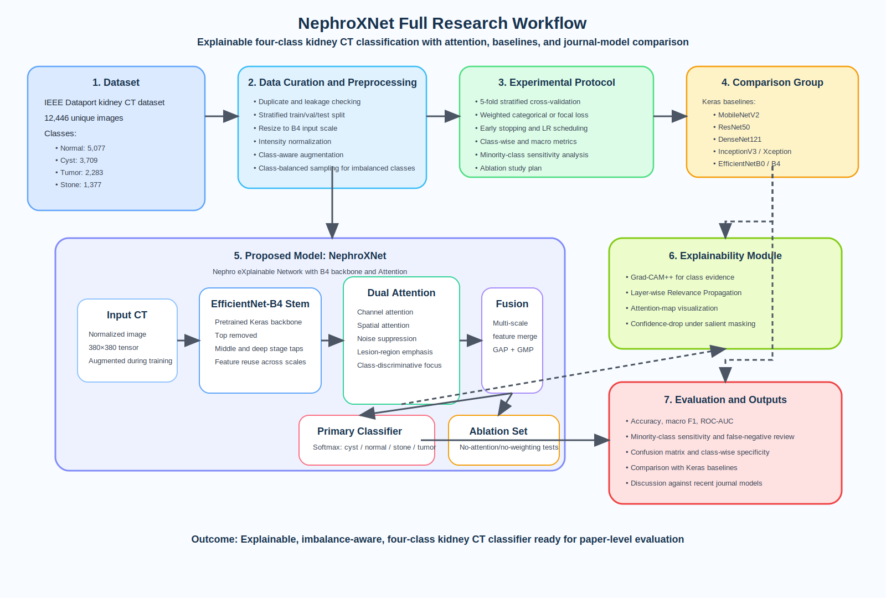

# Proposal Format

## Proposal Title
**Development of NephroXNet for Explainable Four-Class Kidney CT Classification (Cyst/Normal/Stone/Tumor) and Comparative Analysis**

## Abstract
Kidney abnormalities—including cysts, stones, and tumors—are common and can cause substantial morbidity, often requiring prompt imaging-based decisions and follow-up. Recent journal articles have indicated that, again, CT scans are important for urinary disease, although low-dose scans with the help of deep learning are becoming increasingly important for follow-up. However, clinicians require models they can trust, which has brought us to the fact that explainability is now not optional in medical AI.

This proposal focuses on a public four-class kidney CT dataset from IEEE DataPort (cyst/normal/stone/tumor). The main goal is to develop a new Keras-based model, named **NephroXNet**, that is derived from EfficientNet-B4 but redesigned with dual attention, multi-scale fusion, and explainable AI. The model is not intended to be a plain EfficientNet baseline. It will be a new architecture that uses the EfficientNet-B4 backbone only as a starting feature extractor.

The proposed workflow has four parts. First, the CT images will be curated, normalized, and augmented with class-aware sampling because the stone class is the smallest class. Second, NephroXNet will combine an EfficientNet-B4 stem with channel attention, spatial attention, and a lightweight feature-fusion head. Third, we will benchmark NephroXNet against strong Keras baselines—`ResNet50`, `DenseNet121`, `InceptionV3`, `Xception`, `MobileNetV2`, `EfficientNetB0`, and plain `EfficientNetB4`—and discuss the results in relation to similar journal-reported approaches. Fourth, we will explain the model’s predictions using Grad-CAM++, Layer-wise Relevance Propagation, and attention-map visualizations, and we will check faithfulness using tests such as confidence drop after masking the most salient regions.

The expected outcome is a robust and explainable kidney CT classifier with strong class-wise performance across **cyst**, **normal**, **stone**, and **tumor** (with additional attention to the minority stone class under imbalance). The work also aims to provide a clearer experimental benchmark for this dataset and a clinically readable workflow that balances accuracy, transparency, and practical relevance.

## Keywords
Kidney CT classification, cyst, normal, stone, tumor, explainable AI, attention mechanism, NephroXNet, Keras, transfer learning, medical image classification, multi-class diagnosis

## Background and Motivation
Kidney stone disease is not a rare event. It has a high recurrence rate, and it often sends patients to emergency or outpatient care with severe pain. In routine kidney imaging, radiologists also encounter cysts and tumors, and CT remains one of the most reliable tools for evaluating these renal findings. However, repeated CT use raises concerns about radiation dose, image noise, and workload. These issues make automated and reliable image interpretation clinically useful.

Recent work has improved single parts of the problem. Some studies focused on low-dose CT quality and denoising for urolithiasis [2], [3]. Some focused on stone detection or segmentation in X-ray images [4], [5]. Some focused on data-efficient training for small urolithiasis CT datasets [6]. Other studies explored general kidney disease classification in CT [7] or kidney tumor segmentation with EfficientNet-family encoders [8]. These are important steps. Still, a strong gap remains.

Most recent studies do **not** combine all of the following in one pipeline:

1. a **multi-class renal CT task** that includes stone, cyst, tumor, and normal classes,
2. a **modified EfficientNet-B4-based architecture** instead of a plain transfer-learning baseline,
3. **dual attention** to refine disease-relevant features,
4. **XAI outputs** that help humans inspect why the model predicts each class (cyst/normal/stone/tumor),
5. and a **broad comparison** against both standard Keras backbones and similar journal models.

This proposal addresses that gap. It keeps the full four-class setting (cyst, normal, stone, tumor) while still acknowledging that stone is the minority class and clinically important. This is important because real clinical confusion does not happen only between stone and normal; it can also occur between stone, cyst, and tumor findings. A model that separates all four categories is more useful than a narrow binary classifier.

The dataset itself also motivates the work because it is imbalanced, with **stone** as the minority class (see Dataset Description). This imbalance can bias standard classifiers toward easier majority classes. A stone-aware design, weighted loss, and careful evaluation are therefore needed.

Another motivation is trust. Journal reviews in radiology and medical imaging repeatedly show that black-box predictions limit clinical acceptance [14]–[19]. A high-accuracy model is helpful, but a high-accuracy model with transparent visual evidence is much stronger. This is why the proposal includes XAI as a core component, not as an afterthought.

## Problem Statement
Despite the availability of kidney CT data (see Dataset Description), many existing classification pipelines mainly provide a predicted label and confidence; **explainable AI outputs are not consistently available** for clinicians to inspect why a case is labeled cyst/normal/stone/tumor. In addition, off-the-shelf transfer-learning baselines can achieve reasonable performance, but they may not deliver strong **accuracy and class-wise performance** under class imbalance (especially for the minority **stone** class). This project addresses the need for a four-class CT classifier that improves accuracy over standard baselines while providing integrated, faithful XAI visualizations.

## Main Objective
The main objective of this project is to develop an **Explainable Four-Class Kidney CT Classification System** for **cyst**, **normal**, **stone**, and **tumor** images that improves accuracy and class-wise performance (especially for the minority **stone** class) while providing clinically readable XAI outputs. The system will be built around a new attention-enhanced architecture, **NephroXNet**, and will be validated through comparisons with strong Keras baselines and recent journal-reported models.

## Specific Objectives
1. **To develop a new deep model, NephroXNet,** using an EfficientNet-B4-derived backbone, dual attention, and multi-scale feature fusion for four-class kidney CT classification.
2. **To improve class-wise performance under imbalance** (cyst, normal, stone, tumor) by using weighted learning and augmentation.
3. **To compare the proposed model** with multiple Keras base models, namely `MobileNetV2`, `ResNet50`, `DenseNet121`, `InceptionV3`, `Xception`, `EfficientNetB0`, and plain `EfficientNetB4`.
4. **To benchmark the proposed method against similar journal models** reported for kidney stone, urolithiasis, kidney tumor, and explainable medical imaging tasks [4]–[13].
5. **To integrate explainable AI** using Grad-CAM++, Layer-wise Relevance Propagation, and attention heatmaps, then assess their faithfulness and clinical readability [14]–[19].
6. **To produce a complete experimental workflow** that can support a future manuscript, including ablation studies, performance analysis, and visual explanation panels.

## Literature Review
### 1. Clinical and imaging context
Recent journal work confirms that urolithiasis imaging must balance detection quality with dose reduction. Prodhomme et al. showed that submillisievert abdominopelvic CT with deep-learning image reconstruction can still support urinary stone detection, which is clinically important for recurrent patients [2]. Terzis et al. also showed that deep-learning denoising can improve image quality in urolithiasis imaging and can compete with modern iterative reconstruction strategies [3]. These studies are useful for the introduction because they show why CT-based AI for stone care still matters.

Xu et al. reviewed AI in renal ultrasound and highlighted that kidney imaging AI is growing across modalities, but CT remains highly important for structural assessment and stone analysis [20]. Kim and Eun later addressed a practical issue in urolithiasis AI: many clinical centers do not have large labeled datasets. Their self-supervised plus transfer-learning framework improved data efficiency in a small CT setting [6]. This is relevant to the present proposal because it supports careful representation learning when data are limited or imbalanced.

### 2. Kidney stone and kidney disease modeling
Ahmed et al. proposed a VGG16-based explainable framework for kidney stone identification from KUB X-ray images and reported strong test accuracy with LRP-based explanations [4]. Their work is directly relevant because it combines renal stone classification and XAI. However, it is binary and X-ray based, not multi-class CT based. Preedanan et al. addressed stone segmentation in abdominal X-ray images using a cascaded U-Net pipeline with lesion-size reweighting [5]. That paper is important because it shows how small stone targets need special treatment during training.

For broader kidney pathology, Hossain et al. presented an automated CT-based kidney disease classification framework for multiple renal categories [7]. This study is close to the current dataset setting and supports the value of multi-class renal analysis. Abdelrahman and Viriri also showed that EfficientNet-family encoders are effective in kidney tumor CT segmentation [8]. Their results support the use of EfficientNet-scale backbones in renal imaging, even though their task was segmentation.

### 3. Attention mechanisms and backbone design
Attention has become a practical way to improve medical image models. Alruwaili et al. proposed a dual-attention EfficientNet hybrid U-Net and showed that channel and spatial refinement can improve radiographic segmentation [9]. Das et al. also reported gains from attention-enhanced transfer learning in medical X-ray diagnosis [10]. Agarwal et al. showed that EfficientNet-based transfer learning can work well in a clinical imaging task, even outside renal imaging [11]. Shaik et al. later proposed Adaptive Fusion Attention and used Grad-CAM to show stronger focus on pathological areas [12]. Yin et al. also used spatial and channel attention in CT image classification, which supports the value of attention-guided feature refinement in grayscale medical images [13].

These journal studies motivate the design of NephroXNet. The proposed model will not be a plain imported backbone. It will be a modified network with attention added at selected feature stages and with a lighter classification head designed for the kidney CT task.

### 4. Explainable AI in medical imaging
Explainability is one of the strongest needs in medical AI. De Vries et al. reviewed XAI in radiology and nuclear medicine and emphasized the gap between high model performance and real clinical trust [14]. Borys et al. provided a clinician-oriented overview of saliency-based XAI in medical imaging and explained why visual explanation should be interpreted carefully [15]. Bhati et al. surveyed XAI visualization methods across medical imaging and highlighted the strengths and limits of gradient-based, perturbation-based, and attention-based explanations [16].

Raghavan et al. proposed attention-guided Grad-CAM and showed that attention can improve explanation quality by focusing more clearly on discriminative regions [17]. Mukhtorov et al. also demonstrated how explainable deep learning can support endoscopic image classification and communication with users [18]. More recently, Ahmed et al. published a systematic review of XAI in medical imaging and mapped current methods to clinical workflow needs, interpretability challenges, and research gaps [19]. These studies justify the decision to include XAI from the start of the proposed architecture.

### 5. Research gap identified from the literature
The recent literature is strong, but still fragmented.

- Kidney stone papers often focus on **binary detection**, not four-class renal differentiation [4], [5].
- Renal CT papers often focus on **tumor segmentation or broader kidney disease tasks**, not four-class explainable CT classification that includes stone, cyst, normal, and tumor [7], [8].
- Attention papers show clear promise, but most are **not built for the present renal CT dataset** [9]–[13].
- XAI reviews stress clinical trust, yet few kidney stone studies combine **attention, multi-class CT learning, and explainability** in one framework [14]–[19].

Because of this gap, there is room for a new study that is focused, clinically meaningful, and well-structured. This proposal aims to fill that space.

## Aims and Expected Contributions
This study aims to deliver a complete proposal-level framework for explainable kidney CT classification. The expected contributions are listed below.

1. **A new named architecture:** The proposed model will be called **NephroXNet** (*Nephro eXplainable Network with B4 backbone and Attention*).
2. **A four-class formulation with class-wise reporting:** The work will keep the full dataset classes (cyst, normal, stone, tumor), while paying special attention to the minority stone class.
3. **A strong comparison protocol:** The proposed model will be tested against multiple Keras backbones and compared with similar journal models from recent literature.
4. **A clinically readable XAI workflow:** The model will produce visual explanations that can be inspected class by class.
5. **A paper-ready experimental plan:** The proposal is structured to support a future thesis chapter or journal manuscript.

## Dataset Description
The study will use the IEEE DataPort dataset by Jyotismita Chaki, published on August 30, 2024 [1]. Although the dataset title is *Kidney tumor*, it includes four labeled kidney CT categories and is suitable for four-class classification.

- **Task and labels:** four-class image classification with labels **cyst**, **normal**, **stone**, and **tumor**.
- **Size and class distribution (12,446 images total):** cyst (3,709), normal (5,077), stone (1,377), tumor (2,283).
- **Data type (features):** kidney CT images (pixel-intensity values); the input features are the image pixels after resizing and normalization.
- **Why appropriate:** it supports a clinically meaningful multi-class setting and provides a realistic imbalance scenario that motivates weighted learning and class-wise evaluation, especially for the minority stone class.

## Tools and Technologies
- Python
- TensorFlow/Keras
- NumPy, pandas, scikit-learn
- OpenCV/Pillow (preprocessing)
- Matplotlib

## Research Plan and Methodology
### Phase 1: Dataset preparation and experimental design
The study will use the dataset described in the Dataset Description section [1]. Since the class distribution is imbalanced, the experimental design will be stratified.

The dataset preparation stage will include:

- integrity checking and duplicate screening,
- class distribution verification,
- image resizing to the native input scale of the B4 backbone,
- intensity normalization,
- optional contrast enhancement if needed after pilot inspection,
- and class-preserving train/validation/test splitting.

A **stratified split** will be used. If subject-level identifiers are available, subject-wise splitting will be preferred. If not, image-wise stratified splitting with leakage checks will be used. In addition, **5-fold stratified cross-validation** will be applied during model selection.

To reduce the effect of class imbalance, the training pipeline will use a combination of:

- weighted categorical loss,
- minority-aware augmentation,
- balanced mini-batch sampling,
- and class-wise reporting, with sensitivity-focused analysis for the minority stone class.

### Phase 2: Proposed model design — NephroXNet
The core model will be **NephroXNet**. It is a modified Keras architecture derived from EfficientNet-B4, but it is not a plain EfficientNet classifier.

#### Planned architecture
1. **Backbone stem:** a pretrained EfficientNet-B4 feature extractor from Keras, with the original top layers removed.
2. **Multi-scale taps:** intermediate feature maps will be collected from middle and deeper stages of the backbone.
3. **Dual attention refinement:** each selected feature map will pass through a lightweight attention block that combines:
   - **channel attention** to highlight the most informative filters, and
   - **spatial attention** to focus on disease-relevant regions.
4. **Feature fusion head:** refined multi-scale features will be aligned and fused before classification.
5. **Global pooling and dense head:** global average pooling and global max pooling will be combined, followed by dropout and dense layers.
6. **Primary classifier:** a 4-class softmax head for cyst, normal, stone, and tumor.

#### Why this design is suitable
This design follows what recent journal papers suggest. EfficientNet-family models are parameter-efficient and work well in medical imaging [8], [11]. Dual attention can refine both “what” and “where” information [9], [13]. Fusion attention has also been linked to better interpretability [12].

### Phase 3: Explainable AI module
The explainability layer will be part of the methodology, not a final add-on.

The XAI module will include:

- **Grad-CAM++** for class-discriminative saliency,
- **Layer-wise Relevance Propagation (LRP)** for pixel-level contribution mapping,
- **attention heatmap visualization** from the proposed attention blocks,
- and **confidence-drop analysis** by masking the most salient regions.

The rationale comes directly from recent journal reviews and applied studies [14]–[19]. Using more than one explanation method is important because one heatmap alone can be misleading. Agreement between methods will therefore be discussed as part of the analysis.

### Phase 4: Comparative baselines
The proposal includes two comparison groups.

#### A. Standard Keras baselines
The following baseline models will be trained under the same data split and preprocessing policy:

- `MobileNetV2`
- `ResNet50`
- `DenseNet121`
- `InceptionV3`
- `Xception`
- `EfficientNetB0`
- plain `EfficientNetB4`

These models were chosen because they are standard, strong, and easy to justify in medical image classification studies.

#### B. Similar journal-model comparisons
The experimental discussion will also position NephroXNet against the design ideas reported in recent journal papers, especially:

- VGG16 + XAI for kidney stone identification [4],
- cascaded U-Net with lesion-size reweighting for urinary stones [5],
- SSL + transfer learning for urolithiasis CT [6],
- automated kidney CT disease classification [7],
- EfficientNet-family renal tumor segmentation [8],
- and recent attention-driven medical imaging architectures [9]–[13].

Some of these are not identical tasks. That is acceptable in a proposal. They still provide strong methodological anchors for discussion and later manuscript framing.

### Phase 5: Training strategy and ablation study
The training plan will include:

- transfer learning with staged fine-tuning,
- learning-rate scheduling,
- early stopping,
- dropout and regularization,
- and loss weighting for minority classes.

To understand which components actually help, the following ablations will be planned:

1. NephroXNet **without attention**,
2. NephroXNet **with only channel attention**,
3. NephroXNet **with only spatial attention**,
4. NephroXNet **with and without class weighting**.

This is important because proposal claims should be backed by controlled experiments.

### Phase 6: Evaluation protocol
The proposed system will be evaluated using standard classification metrics with clear class-wise reporting for cyst, normal, stone, and tumor.

#### Quantitative metrics
- overall accuracy,
- macro precision,
- macro recall,
- macro F1-score,
- one-vs-rest ROC-AUC,
- confusion matrix,
- class-wise sensitivity and specificity,
- balanced accuracy,
- and Matthews correlation coefficient.

#### Class-wise reporting (all four classes)
The proposal will report per-class results for **cyst**, **normal**, **stone**, and **tumor**, including:

- class-wise sensitivity (recall),
- class-wise precision,
- class-wise F1-score,
- and confusion-matrix error patterns.

Because stone is the smallest class, the analysis will also include a focused review of stone false negatives and common confusions (e.g., stone vs. cyst/tumor/normal).

#### Explainability evaluation
The XAI analysis will be assessed by:

- visual agreement between Grad-CAM++, LRP, and attention maps,
- confidence drop after salient-region masking,
- and case-based discussion of correct and incorrect predictions.

If expert feedback becomes available later, the explanation maps can also be reviewed qualitatively by a domain specialist.

## Expected Outcomes
The project aims to deliver a four-class kidney CT classifier that improves performance over standard Keras baselines while providing usable explainability outputs.

- A trained and documented **NephroXNet** model for cyst/normal/stone/tumor classification
- Benchmark results against standard Keras backbones with clear class-wise reporting
- Improved accuracy and macro-averaged performance indicators relative to plain transfer-learning baselines (evaluated using the metrics in the Evaluation Protocol)
- An explainability set (Grad-CAM++, LRP, attention maps) with qualitative examples and faithfulness checks via salient-region masking
- A manuscript-ready experimental narrative (methods, ablations, results, and discussion)

## Figure 1: Overall workflow of the proposed research
The full workflow diagram for the four-class setting is provided as an SVG file: [kidney_stone_workflow.svg](kidney_stone_workflow.svg).

## Conclusions
This proposal presents a focused and practical direction for explainable kidney CT classification. The work learns four renal classes—**cyst**, **normal**, **stone**, and **tumor**—which is a stronger and more clinically realistic setting than a simple binary problem.

The key idea is to build **NephroXNet**, a renamed and modified EfficientNet-B4-based model that adds dual attention, multi-scale fusion, and XAI support. The model is designed to improve overall class-wise performance while staying interpretable, with additional care for the minority stone class under imbalance. This matters because a clinically useful system should not only predict well. It should also show why it predicts well.

The recent journal literature supports each part of the proposal. It supports CT-based renal imaging, attention-enhanced learning, and explainable model analysis [2]–[20]. At the same time, the literature still leaves space for a strong multi-class and explainable benchmark on the selected dataset, with careful evaluation of minority-class performance. That is the gap this proposal aims to address.

## References
[1] J. Chaki, “Kidney tumor,” IEEE DataPort. Aug. 30, 2024. doi: 10.21227/646s-6y35.

[2] S. Prod’homme, R. Bouzerar, T. Forzini, A. Delabie, and C. Renard, “Detection of urinary
tract stones on submillisievert abdominopelvic CT imaging with deep-learning image
reconstruction algorithm (DLIR),” Abdominal Radiology, vol. 49, no. 6, pp. 1987–1995,
Mar. 2024, doi: 10.1007/s00261-024-04223-w.

[3] R. Terzis et al., “Deep-Learning-Based Image denoising in Imaging of Urolithiasis:
Assessment of image quality and comparison to State-of-the-Art iterative reconstructions,”
Diagnostics, vol. 13, no. 17, p. 2821, Aug. 2023, doi: 10.3390/diagnostics13172821.

[4] F. Ahmed et al., “Identification of kidney stones in KUB X-ray images using VGG16
empowered with explainable artificial intelligence,” Scientific Reports, vol. 14, no. 1, p.
6173, Mar. 2024, doi: 10.1038/s41598-024-56478-4.

[5] W. Preedanan et al., “Urinary stones segmentation in abdominal X-Ray images using
cascaded U-Net pipeline with Stone-Embedding augmentation and Lesion-Size
reweighting approach,” IEEE Access, vol. 11, pp. 25702–25712, Jan. 2023, doi:
10.1109/access.2023.3257049.

[6] J.-S. Kim and S.-J. Eun, “Data-Efficient Deep Learning Framework for Urolithiasis
Detection using Transfer and Self-Supervised Learning,” International Neurourology
Journal, vol. 29, no. Suppl 2, pp. S90–S94, Nov. 2025, doi: 10.5213/inj.2550292.146.

[7] M. N. Hossain, E. Bhuiyan, M. B. A. Miah, T. A. Sifat, Z. Muhammad, and M. F. A. Masud,
“Detection and Classification of Kidney Disease from CT Images: An Automated Deep
Learning Approach,” Technologies, vol. 13, no. 11, p. 508, Nov. 2025, doi:
10.3390/technologies13110508.

[8] A. Abdelrahman and S. Viriri, “EfficientNet family U-Net models for deep learning
semantic segmentation of kidney tumors on CT images,” Frontiers in Computer Science,
vol. 5, Sep. 2023, doi: 10.3389/fcomp.2023.1235622.

[9] M. Alruwaili, M. A. Mahmood, and M. K. Elbashir, “Dual-Attention EfficientNet Hybrid
U-Net for segmentation of rheumatoid arthritis hand X-Rays,” Diagnostics, vol. 15, no. 24,
p. 3105, Dec. 2025, doi: 10.3390/diagnostics15243105.

[10] I. Das et al., “Improving medical X-Ray imaging diagnosis with attention mechanisms
and robust transfer learning techniques,” IEEE Access, vol. 13, pp. 159002–159027, Jan.
2025, doi: 10.1109/access.2025.3607639.

[11] D. Agarwal, M. Á. Berbís, A. Luna, V. Lipari, J. B. Ballester, and I. De La Torre-Díez,
“Automated Medical Diagnosis of Alzheimer´s Disease Using an Efficient Net
Convolutional Neural Network,” Journal of Medical Systems, vol. 47, no. 1, p. 57, May
2023, doi: 10.1007/s10916-023-01941-4.

[12] N. S. Shaik, N. Veeranjaneulu, and J. D. Bodapati, “Adaptive Fusion Attention for
enhanced classification and interpretability in medical imaging,” Machine Vision and
Applications, vol. 36, no. 3, Mar. 2025, doi: 10.1007/s00138-025-01665-0.

[13] S. Yin et al., “Brain CT image classification based on mask RCNN and attention
mechanism,” Scientific Reports, vol. 14, no. 1, p. 29300, Nov. 2024, doi: 10.1038/s41598-
024-78566-1.

[14] B. M. De Vries, G. J. C. Zwezerijnen, G. L. Burchell, F. H. P. Van Velden, C. W. M.-
V. D. H. Van Oordt, and R. Boellaard, “Explainable artificial intelligence (XAI) in
radiology and nuclear medicine: a literature review,” Frontiers in Medicine, vol. 10, p.
1180773, May 2023, doi: 10.3389/fmed.2023.1180773.

[15] K. Borys et al., “Explainable AI in medical imaging: An overview for clinical
practitioners – Beyond saliency-based XAI approaches,” European Journal of Radiology,
vol. 162, p. 110786, Mar. 2023, doi: 10.1016/j.ejrad.2023.110786.

[16] D. Bhati, F. Neha, and M. Amiruzzaman, “A survey on Explainable Artificial
intelligence (XAI) techniques for visualizing deep learning models in medical imaging,”
Journal of Imaging, vol. 10, no. 10, p. 239, Sep. 2024, doi: 10.3390/jimaging10100239.

[17] K. Raghavan, S. B, and K. V, “Attention guided grad-CAM : an improved explainable
artificial intelligence model for infrared breast cancer detection,” Multimedia Tools and
Applications, vol. 83, no. 19, pp. 57551–57578, Dec. 2023, doi: 10.1007/s11042-023-
17776-7.

[18] D. Mukhtorov, M. Rakhmonova, S. Muksimova, and Y.-I. Cho, “Endoscopic image
classification based on explainable deep learning,” Sensors, vol. 23, no. 6, p. 3176, Mar.
2023, doi: 10.3390/s23063176.

[19] F. Ahmed, N. S. Naz, S. Khan, A. U. Rehman, W. M. Ismael, and M. A. Khan,
“Explainable artificial intelligence (XAI) in medical imaging: a systematic review of
techniques, applications, and challenges,” BMC Medical Imaging, vol. 26, no. 1, p. 37, Jan.
2026, doi: 10.1186/s12880-025-02118-w.

[20] T. Xu et al., “A narrative review on the application of artificial intelligence in renal
ultrasound,” Frontiers in Oncology, vol. 13, p. 1252630, Mar. 2024, doi:
10.3389/fonc.2023.1252630.